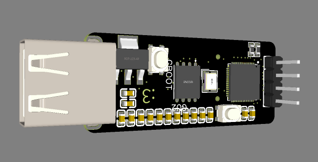
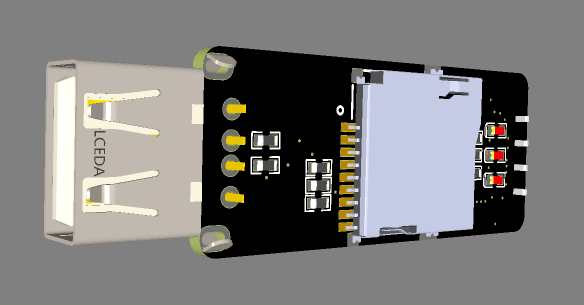

# Pi_Key

Pi_Key is a compact RP2040-powered device designed to look like a USB flash drive while providing the flexibility of a programmable embedded platform.

The device features three status LEDs and a microSD card interface, making it suitable for data logging, portable applications, diagnostics, and custom embedded projects.

## Features

* RP2040 microcontroller
* USB-powered operation
* 3 status LEDs
* microSD card support
* Compact USB flash drive form factor
* Compatible with C/C++, MicroPython, and Rust

## Hardware Overview

### Main Components

* RP2040 Microcontroller
* 3 × Status LEDs
* microSD Card Interface
* USB Connector

## Pinout

### microSD Card Connections

| SD Card Pin | RP2040 GPIO | Function |
| ----------- | ----------- | -------- |
| TBD         | TBD         | MOSI     |
| TBD         | TBD         | MISO     |
| TBD         | TBD         | SCK      |
| TBD         | TBD         | CS       |

### LED Connections

| LED   | RP2040 GPIO | Description        |
| ----- | ----------- | ------------------ |
| LED 1 | TBD         | Status Indicator   |
| LED 2 | TBD         | Activity Indicator |
| LED 3 | TBD         | Error Indicator    |

## Schematic

The complete hardware schematic can be found below.

## Photos

### Front Side

### Back Side

## Applications

* Data logging
* Portable embedded development
* Hardware experimentation
* Educational projects
* Custom USB devices

## Project Status

🚧 Currently under development.

## License

This project is released under the MIT License.
